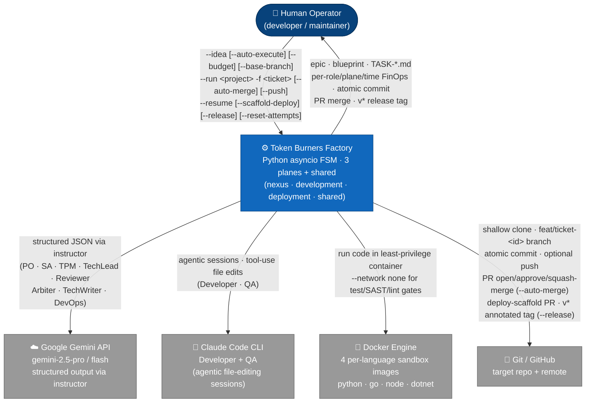
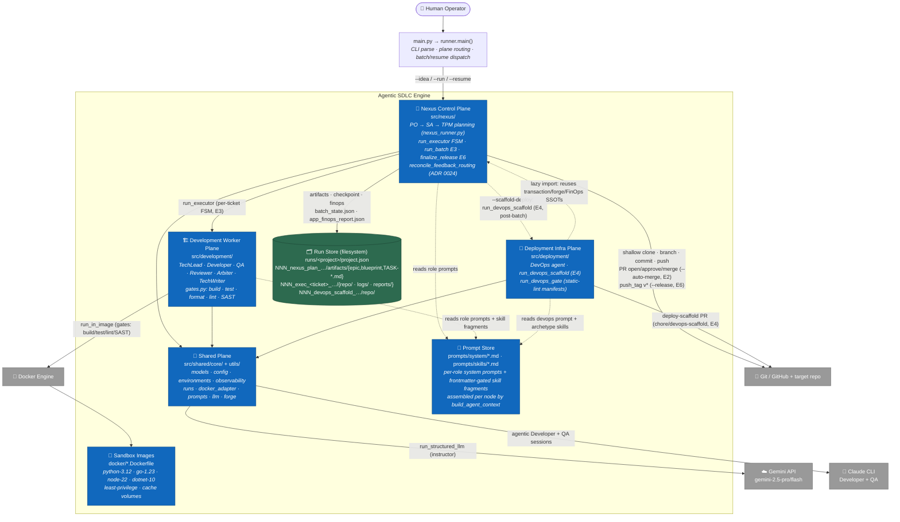
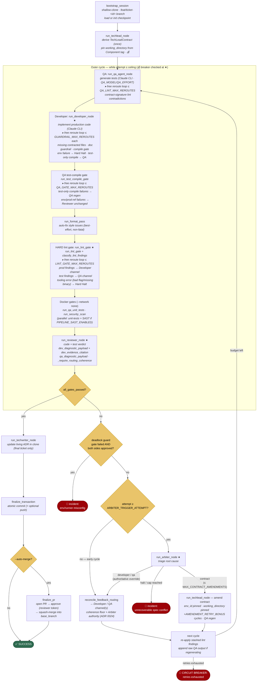
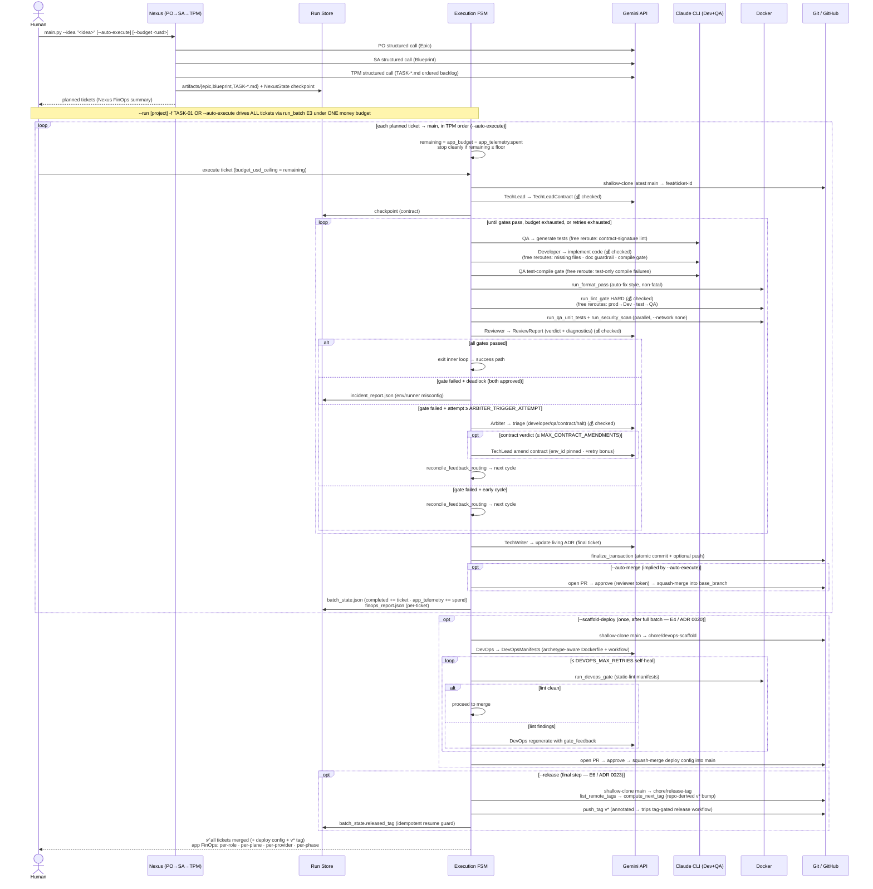
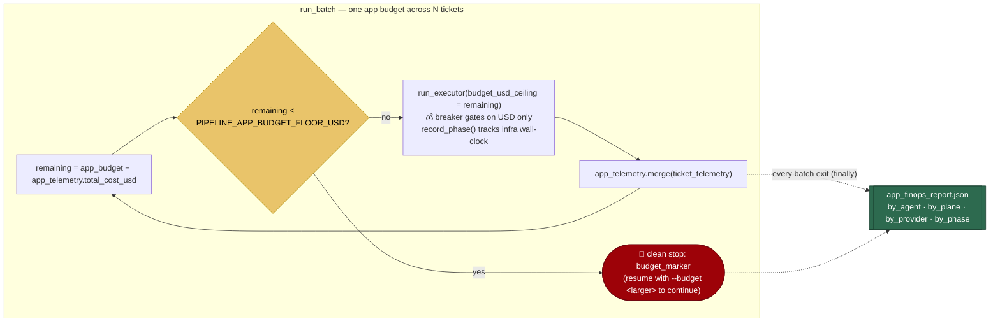

# Architecture (C4)

A deterministic, multi-agent **SDLC automation engine**: it turns a one-line product idea into a planned
backlog and then implements each ticket as verified, committed code — with no human in the loop. It is a
custom Python `asyncio` Finite State Machine (no agentic framework), split into three physical planes over a
shared SSOT (ADR [0021](decisions/0021-physical-three-plane-split.md)): a **Nexus control plane**
(idea → plan → orchestrate), a **Development worker plane** (one ticket → committed code), and a
**Deployment infra plane** (CI/CD scaffolding).

This document follows the [C4 model](https://c4model.com/): **Level 1 (System Context)** → **Level 2
(Containers)** → **Level 3 (Components)** — zooming from "who uses it and what it talks to" down to "how
the per-ticket Executor FSM (`run_executor`) self-heals." Diagrams are Mermaid (GitHub-rendered). The authoritative SSOTs
are [repo-module-map](../.claude/rules/repo-module-map.md), [pipeline-fsm-loops](../.claude/rules/pipeline-fsm-loops.md),
and [agent-provider-model-map](../.claude/rules/agent-provider-model-map.md); this doc visualizes them.

---

## Level 1 — System Context

Who operates the engine and which external systems it depends on.

**Key:**
- **Human Operator** drives everything through one CLI (`main.py` → `src/nexus/runner.py` `main()`):
  `--idea` plans a new project; add `--auto-execute` to drive the Executor over **all** planned tickets to
  `main` in TPM order in the same invocation (E3) — implies `--auto-merge`. `--run <project> -f <ticket>`
  executes one ticket; `--resume` recovers from a checkpoint. `--budget <usd>` sets the application-wide
  money ceiling (E5); re-passing a larger value on `--resume` "adds money." `--scaffold-deploy` triggers E4
  post-batch CI/CD scaffolding; `--release` triggers E6 annotated tag push.
- **Google Gemini API** — every *structured* agent (forced Pydantic output via `instructor`):
  PO/SA/TPM (planning) · TechLead/Reviewer/Arbiter/TechWriter (execution) · DevOps (deploy-scaffolding).
  Models: `gemini-2.5-pro` (TechLead, Arbiter, TechWriter, PO, SA, TPM) · `gemini-2.5-flash` (Reviewer, DevOps).
- **Claude Code CLI** — the *Developer* **and** *QA* agents; both run as agentic sessions that edit files
  directly in the run's clone.
- **Docker Engine** — runs build, unit-test, SAST, lint, and format gates in hardened per-language
  containers (`--network none` for test/SAST/lint; network-on for setup/restore). Four pre-built sandbox
  images: `python`, `go`, `node`, `dotnet`.
- **Git / GitHub remote + target repository** — the executor shallow-clones the target repo on a
  `feat/ticket-<id>` branch, makes one atomic commit on full success, optionally pushes; with `--auto-merge`
  it opens, approves, and squash-merges a PR via the `gh`-backed forge seam (ADR 0018).

---

## Level 2 — Containers

The major runtime units inside the engine boundary and how they collaborate.

**Key:**
- **Nexus control plane** (`src/nexus/`) — owns planning AND orchestration. `run_nexus` drives PO → SA →
  TPM (linear, no loops; `agents/{po,sa,tpm}.py`), writing
  `artifacts/{epic.md, blueprint.md, TASK-*.md}` + a `NexusState` checkpoint. `runner.py` owns `main()`
  (dispatch/resume), the per-ticket FSM (`run_executor`), and the E3 batch loop (`run_batch`), calling into
  the development/deployment planes — never the reverse, save the one documented lazy-import back-edge.
- **Development worker plane** (`src/development/`) — the six execution agents: TechLead (Gemini),
  Developer (Claude CLI), QA (Claude CLI), Reviewer (Gemini), Arbiter (Gemini), TechWriter (Gemini);
  plus `gates.py` (build / test-compile / **lint** / format / SAST + format pass), run per ticket under
  full git + Docker isolation by the nexus FSM.
- **Deployment infra plane** (`src/deployment/`) — the **DevOps** agent (`agents/devops.py`) +
  `provision/` (`scaffold.py` `run_devops_scaffold` + `gates.py` `run_devops_gate`). After a full
  `--auto-execute` batch, `--scaffold-deploy` runs `run_devops_scaffold` once (post-batch terminal phase)
  to generate + merge the app's CI/CD config; self-heals up to `DEVOPS_MAX_RETRIES` times via lint feedback.
  Reuses nexus's transaction/forge/FinOps SSOTs via a **lazy import** — the single `deployment → nexus` edge.
- **Shared plane** (`src/shared/`) — the engine SSOTs all planes import: `core/` (`models.py`,
  `config.py` incl. `ROLE_MODELS`/`AGENT_PLANE`, `observability.py`, `runs.py`, `docker_adapter.py`,
  `environments.py`, `prompts.py`) and `utils/` (`llm.py`, `api_retry.py`, `git_helpers.py`,
  `subprocess_helpers.py`, `redaction.py`, `forge.py`). All LLM traffic flows through here.
- **Prompt store** — per-role system prompts (`prompts/system/*.md`) + frontmatter-gated skill fragments
  (`prompts/skills/*.md`) assembled per node by `build_agent_context`.
- **Sandbox images** — pre-built per-language Docker images: `python-3.12-core`, `go-1.23-cli`,
  `node-22-web`, `dotnet-10-sdk`; each has a dedicated cache volume (pip / go mod / npm / nuget).
- **Run store** — the filesystem is the durable state. Layout SSOT: `src/shared/core/runs.py`.
  Per-ticket reports: `checkpoint.json` (FSM state), `finops_report.json`, `incident_report.json` (on halt).
  Batch-level: `batch_state.json` (`BatchState` with `completed`, `app_telemetry`, `budget_marker`,
  `released_tag`) + `app_finops_report.json` (written in a `finally`, survives any halt).

> **Model routing** ([agent-provider-model-map](../.claude/rules/agent-provider-model-map.md)):
> structured roles use **Gemini** (`ROLE_MODELS` in `config.py`); **Developer** and **QA** run as **Claude
> CLI** agentic sessions. Gemini cost is *estimated* (`MODEL_PRICING_MATRIX`), Claude cost is
> *authoritative* (CLI-reported). Neither tokens nor infra time is a ceiling — **USD only** gates the breaker.

---

## Level 3 — Executor FSM (the self-healing loop)

One ticket's execution cycle. TechLead derives the contract **once**; the outer loop self-heals across
cycles via two isolated feedback channels (Developer / QA) plus the **Arbiter**'s third route (amend the
contract). Free fast-fail reroutes (QA signature-lint, Developer guardrails, QA test-compile gate, lint
gate) bypass the Reviewer without spending the functional retry budget. Faithful to
[pipeline-fsm-loops](../.claude/rules/pipeline-fsm-loops.md).

**Key:**
- **Contract once, loop many:** `run_techlead_node` runs before the loop (and only again on Arbiter
  `contract` verdict). The contract is the single source of truth; cycle 1 generates tests *before* the
  Developer (contract-first TDD).
- **Free fast-fail reroutes (no retry budget consumed):**
  - *QA lint* (`≤ QA_LINT_MAX_REROUTES`): contract-signature contradictions reroute to QA only.
  - *Developer guardrails* (`≤ GUARDRAIL_MAX_REROUTES` each): missing contracted files, doc guardrail
    (undocumented new files), compile gate — each is its own free-reroute budget. Environmental failures
    (network/restore) trigger Hard Halt. Test-only compile failures route to QA, not Developer.
  - *QA test-compile gate* (`≤ QA_GATE_MAX_REROUTES`): test-only compile failures reroute to QA for
    regeneration; env/production-referencing failures pass to the Reviewer unchanged.
  - *Lint gate* (`≤ LINT_GATE_MAX_REROUTES`): `classify_lint_findings` routes production findings to the
    Developer channel and test findings to the QA channel; residual findings after the free budget are
    stashed and re-applied after Reviewer routing in the next cycle. Tooling errors (bad flag / missing
    binary) trigger Hard Halt as an environment incident. The per-env `lint_cmd` is the SSOT the
    `--scaffold-deploy` CI runs verbatim — engine-green ⇒ CI-green (ADR 0020).
  - *Format pass* (`run_format_pass`): best-effort auto-fix before the HARD lint gate; non-fatal.
- **Two isolated channels — routing-coherence enforced (ADR [0024](decisions/0024-routing-coherence-reconciler.md)):**
  `reconcile_feedback_routing` assigns `dev_diagnostic_payload` → Developer and `qa_diagnostic_payload` →
  QA; the `ReviewReport` biconditional validator `_require_routing_coherence` forbids a payload on an
  approved side; a production rejection must carry a verbatim `dev_evidence_citation`. The Arbiter's
  `developer`/`qa` verdict is **authoritative** and overrides a Reviewer misroute.
- **Parallel validation:** `run_qa_unit_tests` and `run_security_scan` (Semgrep SAST, if
  `PIPELINE_SAST_ENABLED`) run concurrently inside Docker (`--network none`); timed as a single
  `qa+sast` phase for wall-clock accuracy.
- **Arbiter (ADR [0016](decisions/0016-arbiter-contract-self-healing.md)):** on a stuck cycle (`attempt ≥
  ARBITER_TRIGGER_ATTEMPT`) it adds a third route — amend the **contract** — for failures no worker can
  fix. Bounded: `environment_id` pinned, `MAX_CONTRACT_AMENDMENTS` cap, a `AMENDMENT_RETRY_BONUS` per
  amendment. Its `developer`/`qa` routes are authoritative (ADR 0024).
- **Terminals:** SUCCESS (commit + optional PR merge), deadlock-guard incident, Arbiter halt, or the
  Financial Circuit Breaker / "retries exhausted" hard-halt — each writes `reports/incident_report.json`.
- **Money-only breaker (E5, ADR [0022](decisions/0022-application-wide-finops-budget.md)):** 💰 checkpoints
  call `enforce_financial_circuit_breaker(ctx, budget_usd)` where `budget_usd` is the *remaining*
  application budget threaded in by `run_batch` (`app_budget − spent`); gates on **USD only** — tokens are
  reported, never a ceiling.

---

## End-to-end sequence

From a raw idea to committed code across the planes (control → worker, then the optional deploy-scaffold
and release tag).

---

## FinOps & the application budget (E5)

A single **money** ceiling governs a whole `--idea --auto-execute` build (ADR
[0022](decisions/0022-application-wide-finops-budget.md)) — `PIPELINE_APP_BUDGET_USD` (default `$25`,
env-overridable) or the per-invocation `--budget <usd>` flag. The Financial Circuit Breaker is **money-only**:
tokens are measured and reported (`total_tokens`, `total_cache_read_tokens`, `total_cache_write_tokens`),
but never a ceiling (the agentic Claude CLI re-sends its prompt each turn, so cache-heavy token counts are
a poor gate — USD, authoritative for Claude and estimated for Gemini, is the honest signal).

**Key:**
- **One ceiling, threaded remaining.** `run_batch` keeps the running spend in `BatchState.app_telemetry`
  (Nexus planning + every ticket + DevOps, via `PipelineTelemetry.merge`) and threads `remaining` into each
  ticket's breaker. Below `PIPELINE_APP_BUDGET_FLOOR_USD` it stops cleanly **before** spending more.
- **Resume-safe + re-budgetable.** `app_telemetry` persists; the ceiling is **never** persisted (re-resolved
  per invocation), so `--resume … --budget <larger>` adds money and continues past a `budget_marker`.
- **Four-dimensional reporting.** Each agent call records `cost / tokens (in/out/cache, cache excluded from
  the budgeted total) / duration / plane`; each Docker/git/forge phase records wall-clock via `record_phase`.
  `finops_report` rolls up `by_agent`, `by_plane` (nexus/development/deployment), `by_provider`
  (gemini/claude), and `by_phase` (infra phases). The per-run `reports/finops_report.json` and the
  batch-level `reports/app_finops_report.json` carry the full breakdown; `log_finops_summary` prints the
  GRAND TOTAL with per-plane subtotals + total wall-clock.

---

## Component reference

The Level-3 components in text (file → responsibility). See [repo-module-map](../.claude/rules/repo-module-map.md)
for the full module map and [agent-contracts](../.claude/rules/agent-contracts.md) for each agent's I/O model.

| Plane | Component | File | Responsibility |
|---|---|---|---|
| Entry | CLI / router | `main.py` → `src/nexus/runner.py` `main()` | Parse args (`--idea / --run / --resume / --auto-execute / --auto-merge / --push / --scaffold-deploy / --release / --budget / --reset-attempts`); route to planning vs. ticket execution; `--resume` dispatch (incl. batch re-entry); on `--idea --auto-execute`, drive ALL tickets to `main` via `run_batch` (`prepare_ticket_run` + `run_executor` per ticket, `get_tasks_for_nexus_run` for order, `BatchState` checkpoint). |
| Nexus | PO / SA / TPM | `src/nexus/agents/{po,sa,tpm}.py` | Idea → Epic → Blueprint → task tickets (structured Gemini, `gemini-2.5-pro`). |
| Nexus | Runner / State | `src/nexus/nexus_runner.py`, `state.py` | Drive PO→SA→TPM; `NexusState` checkpoint + resume. |
| Nexus | FSM driver | `src/nexus/runner.py` | `main()` dispatch/resume; per-ticket FSM (`run_executor`) — bootstrap, TechLead, outer cycle (QA → Developer → test-compile gate → format → lint → parallel test+SAST → Reviewer → routing/Arbiter/amend), reroutes, breaker, `reconcile_feedback_routing` (coherence floor + Arbiter authority, ADR 0024), commit; E3 batch loop (`run_batch`). |
| Nexus | Release-tag | `src/nexus/runner.py` `finalize_release` + `compute_next_tag` | Post-batch terminal phase (`--release`, E6): clone `main` → `list_remote_tags` → `compute_next_tag` (repo-derived `v*` bump by `RELEASE_VERSION_BUMP`, `v0.1.0` greenfield) → push annotated tag via forge seam; idempotent via `BatchState.released_tag`. |
| Development | TechLead | `src/development/agents/techlead.py` | Derive (and, in amendment mode, re-derive) the `TechLeadContract`; pins `working_directory` from `## Component` tag (deterministic monorepo override). |
| Development | Developer | `src/development/agents/developer.py` | Implement production code in the clone (Claude CLI, agentic; bounded by `DEVELOPER_CLI_TIMEOUT`/`DEVELOPER_CLI_IDLE_TIMEOUT`). |
| Development | QA | `src/development/agents/qa.py` | Generate per-module tests via Claude CLI (`QA_MODEL`/`QA_EFFORT`; bounded by `QA_CLI_TIMEOUT`/`QA_CLI_IDLE_TIMEOUT`); `_sandbox_root()` roots test placement for monorepo tickets. |
| Development | Reviewer | `src/development/agents/reviewer.py` | Code + test verdict; isolated dev/QA diagnostics + `dev_evidence_citation` (verbatim proof for a production rejection); coherence-validated by `_require_routing_coherence` (ADR 0024). |
| Development | Arbiter | `src/development/agents/arbiter.py` | Triage stuck cycle (`attempt ≥ ARBITER_TRIGGER_ATTEMPT`) → developer / qa / contract / halt; authoritative channel override (ADR 0024). |
| Development | TechWriter | `src/development/agents/techwriter.py` | Maintain the living ADR (`docs/architecture_state.md` in the clone); runs on success path before commit. |
| Development | Gates | `src/development/gates.py` | `run_format_pass` (auto-fix, non-fatal) · `run_lint_gate` + `classify_lint_findings` (HARD gate, SSOT for CI) · `run_test_compile_gate` · `run_qa_unit_tests` · `run_security_scan` (Semgrep SAST) — all via `docker_adapter`. |
| Deployment | DevOps | `src/deployment/agents/devops.py` | Generate `DevOpsManifests` (archetype-aware Dockerfile + GitHub Actions deploy workflow, WIF) for the finished app (`--scaffold-deploy`, E4). Models: `gemini-2.5-flash`. |
| Deployment | Deploy-scaffold | `src/deployment/provision/scaffold.py` `run_devops_scaffold` | Post-batch terminal phase (E4): clone `main` → DevOps node → `run_devops_gate` (self-heal loop ≤ `DEVOPS_MAX_RETRIES`) → merge `chore/devops-scaffold` via the forge flow. |
| Deployment | Deploy gate | `src/deployment/provision/gates.py` `run_devops_gate` | Static-lint the manifests (YAML + Dockerfile directives); for a `requires_public_invoker` target assert public invocation (no HTTP 403) + a repo-derived service name (no overwrite) — ADR 0026. |
| Shared | Models | `src/shared/core/models.py` | `GlobalPipelineContext`, `TechLeadContract`, `ReviewReport`, `ArbiterVerdict`, `BatchState` (E3 checkpoint + E5 `app_telemetry`/`budget_marker`/`nexus_merged` + E6 `released_tag`), `DevOpsManifests` (E4 deploy config), `PipelineTelemetry` (per-agent tokens/cost/duration/**plane**/provider + `record_phase` for infra · `by_plane()`/`by_provider()`/`merge()`/`finops_report()`). |
| Shared | Config | `src/shared/core/config.py` | `ROLE_MODELS` (Developer + QA absent — Claude CLI), `AGENT_PLANE` (label→plane), app-wide money budget (`PIPELINE_APP_BUDGET_USD` + floor), `RELEASE_VERSION_BUMP` (E6 tag bump), `PIPELINE_REVIEWER_STRICT` / `PIPELINE_SAST_ENABLED` toggles, FSM constants (`MAX_FUNCTIONAL_RETRIES`, `ARBITER_TRIGGER_ATTEMPT`, `MAX_CONTRACT_AMENDMENTS`, `AMENDMENT_RETRY_BONUS`, reroute budgets), timeouts, pricing. |
| Shared | Observability | `src/shared/core/observability.py` | Logging, per-role/**plane**/provider/time FinOps telemetry (`log_token_usage` reads per-call time from the `run_structured_llm` ContextVar), money-only `log_finops_summary`, finish-reason diagnostics. |
| Shared | Run layout | `src/shared/core/runs.py` | `Projects` store + `allocate_run_dir` (run-layout SSOT: `NNN_<plane>_<label>_<ts>_<uid6>/`). |
| Shared | Docker adapter | `src/shared/core/docker_adapter.py` | Least-privilege `run_in_image` / `execute_in_sandbox`; cache-volume management. |
| Shared | Environments | `src/shared/core/environments.py` | `SUPPORTED_ENVIRONMENTS`: `python-3.12-core` · `go-1.23-cli` · `node-22-web` · `dotnet-10-sdk` — each with `image` / `setup_cmd` / `build_cmd` / `test_cmd` / `lint_cmd` / `format_cmd` / `test_compile_cmd` / `dependency_manifest` / `authoring_contract` / `language_id`; `lint_cmd` is the SSOT shared with the generated CI; `resolve_environment(env_id, env_overlays)` merges skill-declared command overrides. `SUPPORTED_DEPLOY_TARGETS`: `gcp-cloud-run` (rest_api/crud_app · public invoker) · `github-release` (cli_tool) · `gcp-cloud-run-monorepo` (fullstack_monorepo · both services public) — `archetypes`/`skill`/`runtime_constraints`/`requires_public_invoker` (ADR 0026). |
| Shared | Prompts | `src/shared/core/prompts.py` | `get_system_prompt*`, `build_agent_context` (skill routing). |
| Shared | LLM / retry | `src/shared/utils/{llm,api_retry}.py` | `run_structured_llm` (relocates Jinja-marker system messages to a user turn for GenAI); backoff + non-retryable/RECITATION handling. |
| Shared | PR forge | `src/shared/utils/forge.py` | Provider-agnostic `open_pr`/`approve_pr`/`merge_pr` (`gh`-backed, `--auto-merge` loop closure) + `list_remote_tags`/`push_tag` (E6 `--release` annotated-tag push, boundary-safe `_run_git`). |

---

*Diagrams reflect the engine as of [CHANGELOG](../CHANGELOG.md) current HEAD — Developer + QA both on Claude CLI, 4-environment registry (`python-3.12-core` · `go-1.23-cli` · `node-22-web` · `dotnet-10-sdk`), 3-target deploy registry (`gcp-cloud-run` · `github-release` · `gcp-cloud-run-monorepo`), format pass before HARD lint gate, parallel unit-test + SAST validation, four-dimensional FinOps (`by_agent`/`by_plane`/`by_provider`/`by_phase`), over the fullstack monorepo support + arbiter production-code oracle of v0.26.0 (ADR [0027](decisions/0027-installable-cli-and-factory-self-release.md)), the deployment-target registry + reachability gates of v0.25.0 (ADR [0026](decisions/0026-deploy-target-registry-and-reachability-gates.md)), and the routing-coherence hardening of v0.24.0 (ADR [0024](decisions/0024-routing-coherence-reconciler.md)). For the "why" behind each decision see [decisions/](decisions/README.md); for what's still open see [BACKLOG.md](BACKLOG.md).*
