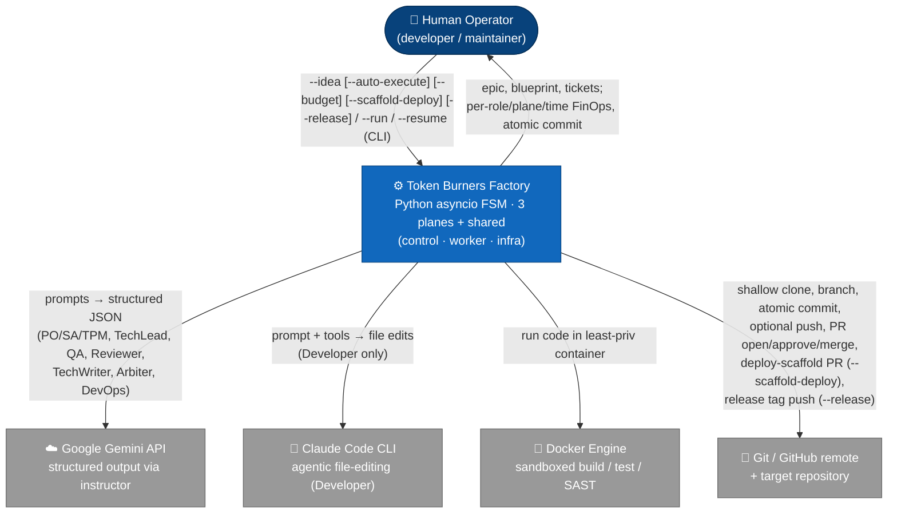
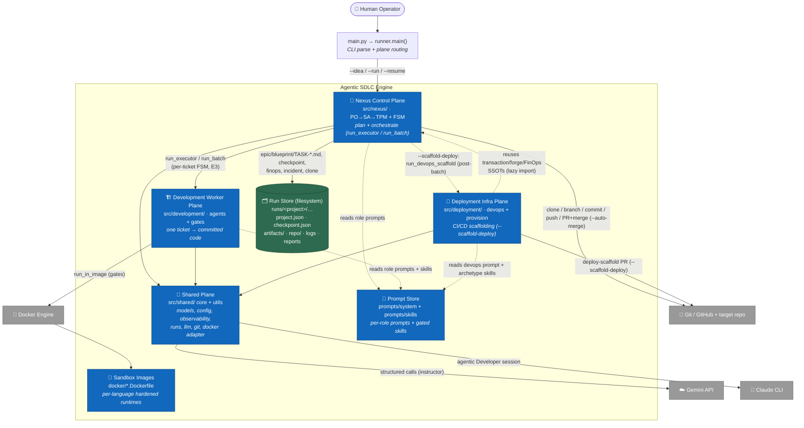
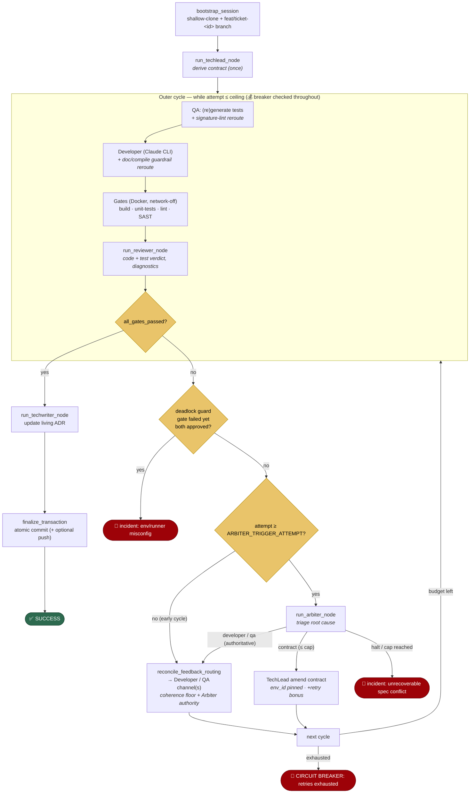
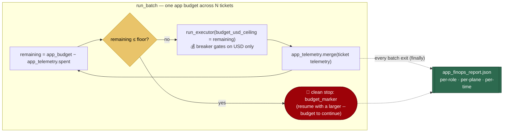

# Architecture (C4)

A deterministic, multi-agent **SDLC automation engine**: it turns a one-line product idea into a planned
backlog and then implements each ticket as verified, committed code — with no human in the loop. It is a
custom Python `asyncio` Finite State Machine (no agentic framework), split into three physical planes over a
shared SSOT (ADR [0021](decisions/0021-physical-three-plane-split.md)): a **Nexus control plane**
(idea → plan → orchestrate), a **Development worker plane** (one ticket → committed code), and a
**Deployment infra plane** (CI/CD scaffolding).

This document follows the [C4 model](https://c4model.com/): **Level 1 (System Context)** → **Level 2
(Containers)** → **Level 3 (Components)** — zooming from "who uses it and what it talks to" down to "how
the per-ticket Executor FSM (`run_executor`) self-heals." Diagrams are Mermaid (GitHub-rendered). The authoritative SSOTs
are [repo-module-map](../.claude/rules/repo-module-map.md), [pipeline-fsm-loops](../.claude/rules/pipeline-fsm-loops.md),
and [agent-provider-model-map](../.claude/rules/agent-provider-model-map.md); this doc visualizes them.

---

## Level 1 — System Context

Who operates the engine and which external systems it depends on.



**Key:**
- **Human Operator** drives everything through one CLI (`main.py` → `src/nexus/runner.py` `main()`):
  `--idea` plans a new project (add `--auto-execute` to then drive the Executor over **all** planned tickets
  to `main` in order, in the same invocation — E3), `--run <project> -f <ticket>` executes one ticket,
  `--resume` recovers. `--budget <usd>` sets the application-wide money ceiling for the whole build (E5);
  re-passing a larger value on a `--resume` "adds money" and continues a budget-halted batch.
- **Google Gemini API** — every *structured* agent (forced Pydantic output via `instructor`):
  PO/SA/TPM (planning) and TechLead/QA/Reviewer/TechWriter/Arbiter/DevOps (execution + deploy-scaffolding).
- **Claude Code CLI** — the *Developer* agent only; agentic, edits files directly in the run's clone.
- **Docker Engine** — runs the build, unit-test, and SAST gates in a hardened, least-privilege container
  (`--network none` for test/SAST).
- **Git / GitHub remote + target repository** — the executor shallow-clones the target repo, works on a
  `feat/ticket-<id>` branch, and makes one atomic commit (optionally pushed) on full success; with
  `--auto-merge` it then opens, approves, and squash-merges a PR into `base_branch` via the `gh`-backed
  forge seam (ADR 0018), closing the loop to `main`.

---

## Level 2 — Containers

The major runtime units inside the engine boundary and how they collaborate.



**Key:**
- **Nexus control plane** (`src/nexus/`) — owns planning AND orchestration. `run_nexus` drives PO → SA →
  TPM (linear, no loops, no Docker/git; `agents/{po,sa,tpm}.py`), writing
  `artifacts/{epic.md, blueprint.md, TASK-*.md}` + a `NexusState` checkpoint. `runner.py` then owns `main()`
  (dispatch/resume), the per-ticket FSM (`run_executor`), and the E3 batch loop (`run_batch`), calling into
  the development/deployment planes — never the reverse, save the one documented lazy-import back-edge below.
- **Development worker plane** (`src/development/`) — the six execution agents (`agents/`: techlead,
  developer, qa, reviewer, arbiter, techwriter) + `gates.py` (build/test/**lint**/SAST + format pass), run
  per ticket under full git + Docker isolation by the nexus FSM.
- **Deployment infra plane** (`src/deployment/`) — the **DevOps** agent (`agents/devops.py`) + `provision/`
  (`scaffold.py` `run_devops_scaffold` + `gates.py` `run_devops_gate`). After a full `--auto-execute` batch,
  `--scaffold-deploy` runs `run_devops_scaffold` once (post-batch terminal phase) to generate + merge the
  app's CI/CD config (ADR 0020); it reuses nexus's transaction/forge/FinOps SSOTs via a **lazy import** — the
  single `deployment → nexus` edge.
- **Shared plane** (`src/shared/`) — the engine SSOTs all planes import: `core/` (`models.py`,
  `config.py` incl. `ROLE_MODELS`, `observability.py`, `runs.py`, `docker_adapter.py`, `environments.py`,
  `prompts.py`) and `utils/` (`llm.py`, `api_retry.py`, `git_helpers.py`, `subprocess_helpers.py`,
  `redaction.py`, `forge.py` — the `gh`-backed PR open/approve/merge seam). All LLM traffic flows through here.
- **Prompt store** — per-role system prompts (`prompts/system/*.md`) + frontmatter-gated skill fragments
  (`prompts/skills/*.md`) assembled per node by `build_agent_context`.
- **Sandbox images** — pre-built per-language Docker images invoked by `environment_id`.
- **Run store** — the filesystem is the durable state: every run is `runs/<project>/<NNN>_<plane>_<label>_<ts>_<uid>/`
  with `logs/`, `reports/` (checkpoint/finops/incident), and `artifacts/` (Nexus) or `repo/` (Executor).

> **Model routing** ([agent-provider-model-map](../.claude/rules/agent-provider-model-map.md)): every
> structured role is **Gemini** (`ROLE_MODELS` in `config.py`); the **Developer** alone is the **Claude
> CLI**. Gemini cost is *estimated* (`MODEL_PRICING_MATRIX`), Claude cost is *authoritative* (CLI-reported).

---

## Level 3 — Executor FSM (the self-healing loop)

The most intricate part: one ticket's execution cycle. The TechLead derives the contract **once**; the
outer loop then self-heals across cycles via two isolated feedback channels (Developer / QA) plus the
**Arbiter**'s third route (amend the contract). Faithful to
[pipeline-fsm-loops](../.claude/rules/pipeline-fsm-loops.md).



**Key:**
- **Contract once, loop many:** `run_techlead_node` runs before the loop; the contract is the single
  source of truth all downstream agents inherit. Cycle 1 generates tests *before* the Developer
  (contract-first).
- **Two isolated channels — routing-coherence enforced (ADR [0024](decisions/0024-routing-coherence-reconciler.md)):**
  `reconcile_feedback_routing` assigns the channels — `dev_diagnostic_payload` → Developer (`error_trace`),
  `qa_diagnostic_payload` → QA (`qa_error_trace`) — but only for a genuinely-rejected side (the `ReviewReport`
  biconditional validator `_require_routing_coherence` forbids a payload on an approved side), and a
  production rejection must carry a verbatim `dev_evidence_citation`. A Reviewer mis-route no longer
  deadlocks the run: the Arbiter's `developer`/`qa` verdict is **authoritative** and overrides it.
- **Free fast-fail reroutes** (QA signature-lint, Developer doc/compile guardrails, QA test-compile gate,
  and the **lint gate** — step 3.6: prod findings → Developer, test findings → QA) bypass the expensive
  Reviewer without spending the functional retry budget. The HARD lint gate's per-env `lint_cmd` is the SSOT
  the `--scaffold-deploy` CI runs verbatim, so engine-green ⇒ CI-green (ADR 0020).
- **Arbiter (ADR [0016](decisions/0016-arbiter-contract-self-healing.md)):** on a stuck cycle it adds a
  third route — amend the **contract** — for failures no worker can fix (contradictory spec, missing error
  precedence, NFR-violating "fix"). Bounded: `environment_id` pinned, `MAX_CONTRACT_AMENDMENTS` cap, a
  retry-budget bonus per amendment. Its `developer`/`qa` routes are now **authoritative** (ADR
  [0024](decisions/0024-routing-coherence-reconciler.md)): when they disagree with which side the Reviewer
  rejected, `reconcile_feedback_routing` moves the fix into the Arbiter-chosen channel and aligns
  `regenerate_tests` — overriding a Reviewer misroute instead of falling through to it.
- **Terminals:** SUCCESS (commit), deadlock-guard incident, Arbiter halt, or the Financial Circuit Breaker
  / "retries exhausted" hard-halt — each writes `reports/incident_report.json`.
- **Money-only breaker (E5, ADR [0022](decisions/0022-application-wide-finops-budget.md)):** the 💰 checkpoints
  call `enforce_financial_circuit_breaker(ctx, budget_usd)` where `budget_usd` is the *remaining* application
  budget threaded in by `run_batch` (`app_budget − spent`); it gates on **USD only** — tokens are reported,
  never a ceiling.

---

## End-to-end sequence

From a raw idea to committed code across the planes (control → worker, then the optional deploy-scaffold).

```mermaid
sequenceDiagram
    actor H as Human
    participant N as Nexus (PO→SA→TPM)
    participant FS as Run Store
    participant X as Execution FSM
    participant G as Gemini
    participant C as Claude CLI
    participant R as Git/GitHub

    H->>N: main.py --idea "<idea>" [--auto-execute] [--budget <usd>]
    N->>G: PO→SA→TPM (structured)
    N->>FS: artifacts/{epic,blueprint,TASK-*}.md + checkpoint
    N-->>H: planned tickets

    Note over H,X: --run <project> -f TASK-01 (one ticket)<br/>OR --auto-execute drives ALL tickets (run_batch, E3)<br/>under ONE money budget; halts cleanly if exhausted (E5)
    loop each planned ticket → main, in TPM order (--auto-execute)
        X->>X: remaining = app_budget − spent; stop cleanly if ≤ floor
        H->>X: execute ticket (breaker ceiling = remaining)
        X->>R: shallow-clone latest main → feat/ticket-<id>
        X->>G: TechLead → contract
        loop until gates pass or budget exhausted
            X->>G: QA (tests) · Reviewer (verdict) · [Arbiter]
            X->>C: Developer (edit repo/)
            X->>X: Docker gates (build/test/lint/SAST)
        end
        X->>G: TechWriter (living ADR)
        X->>R: atomic commit (+ optional push)
        opt --auto-merge (implied by --auto-execute)
            X->>R: open PR → approve (reviewer token) → squash-merge into base
        end
        X->>FS: batch_state.json (completed += ticket; app_telemetry += spend)
    end
    opt --scaffold-deploy (once, after the whole batch — E4 / ADR 0020)
        X->>R: shallow-clone main → chore/devops-scaffold
        X->>G: DevOps → DevOpsManifests (archetype-aware)
        X->>X: run_devops_gate (static-lint the manifests)
        X->>R: open PR → approve → squash-merge deploy config into main
    end
    opt --release (final step, after the batch + optional scaffold — E6 / ADR 0023)
        X->>R: shallow-clone main → chore/release-tag; git ls-remote --tags
        X->>X: compute_next_tag (latest v* bumped; v0.1.0 greenfield)
        X->>R: git push origin v* (annotated tag → trips the tag-gated release workflow)
    end
    X-->>H: ✅ all tickets merged (+ deploy config + released v* tag) + app-wide FinOps (per-role/plane/time)
```

---

## FinOps & the application budget (E5)

A single **money** ceiling governs a whole `--idea --auto-execute` build (ADR
[0022](decisions/0022-application-wide-finops-budget.md)) — `PIPELINE_APP_BUDGET_USD` (default `$25`,
env-overridable) or the per-invocation `--budget <usd>` flag. The Financial Circuit Breaker is **money-only**:
tokens are measured and reported, but never a ceiling (the agentic Claude CLI re-sends its prompt each turn,
so cache-heavy token counts are a poor gate — USD, authoritative for Claude and estimated for Gemini, is the
honest signal).



**Key:**
- **One ceiling, threaded remaining.** `run_batch` keeps the running spend in `BatchState.app_telemetry`
  (Nexus planning + every ticket + DevOps, via `PipelineTelemetry.merge`) and threads `remaining` into each
  ticket's breaker. Below `PIPELINE_APP_BUDGET_FLOOR_USD` it stops cleanly **before** spending more.
- **Resume-safe + re-budgetable.** `app_telemetry` persists; the ceiling is **never** persisted (re-resolved
  per invocation), so `--resume … --budget <larger>` adds money and continues past a `budget_marker`.
- **Three-dimensional reporting.** Each agent call records `cost / tokens (in/out/cache, cache excluded from
  the budgeted total) / duration / plane`; `finops_report` rolls these up `by_agent`, `by_plane`
  (nexus/development/deployment) and `by_provider`. The per-run `reports/finops_report.json` and the
  batch-level `reports/app_finops_report.json` (written in a `finally`, so it survives any halt) carry the
  full breakdown; `log_finops_summary` prints the GRAND TOTAL with per-plane subtotals + total wall-clock.

---

## Component reference

The Level-3 components in text (file → responsibility). See [repo-module-map](../.claude/rules/repo-module-map.md)
for the full module map and [agent-contracts](../.claude/rules/agent-contracts.md) for each agent's I/O model.

| Plane | Component | File | Responsibility |
|---|---|---|---|
| Entry | CLI / router | `main.py` → `src/nexus/runner.py` `main()` | Parse args; route to planning vs. ticket execution; `--resume` dispatch (incl. batch re-entry); on `--idea --auto-execute`, drive ALL tickets to `main` via `run_batch` (`prepare_ticket_run` + `run_executor` per ticket, `get_tasks_for_nexus_run` for order, `BatchState` checkpoint). |
| Nexus | PO / SA / TPM | `src/nexus/agents/{po,sa,tpm}.py` | Idea → Epic → Blueprint → task tickets (structured Gemini). |
| Nexus | Runner / State | `src/nexus/nexus_runner.py`, `state.py` | Drive PO→SA→TPM; `NexusState` checkpoint + resume. |
| Nexus | FSM driver | `src/nexus/runner.py` | `main()` dispatch/resume; per-ticket FSM (`run_executor`) — outer cycle, reroutes, breaker, routing (`reconcile_feedback_routing` — coherence floor + Arbiter authority, ADR 0024), commit; E3 batch loop (`run_batch`). |
| Nexus | Release-tag | `src/nexus/runner.py` `finalize_release` + `compute_next_tag` | Post-batch terminal phase (`--release`, E6): clone `main` → resolve the next `v*` (repo-derived, `RELEASE_VERSION_BUMP`) → push an annotated tag via the forge seam; idempotent via `BatchState.released_tag`. |
| Development | TechLead | `src/development/agents/techlead.py` | Derive (and, in amendment mode, re-derive) the `TechLeadContract`. |
| Development | Developer | `src/development/agents/developer.py` | Implement code in the clone (Claude CLI, agentic). |
| Development | QA | `src/development/agents/qa.py` | Generate per-module tests (contract-first). |
| Development | Reviewer | `src/development/agents/reviewer.py` | Code + test verdict; isolated dev/QA diagnostics + `dev_evidence_citation` (verbatim proof for a production rejection); coherence-validated by `_require_routing_coherence` (ADR 0024). |
| Development | Arbiter | `src/development/agents/arbiter.py` | Triage stuck cycle → developer/qa/contract/halt. |
| Development | TechWriter | `src/development/agents/techwriter.py` | Maintain the living ADR (`docs/architecture_state.md` in the clone). |
| Development | Gates | `src/development/gates.py` | Build / unit-test / **lint** (`run_lint_gate` + `classify_lint_findings`) / SAST in the sandbox. |
| Deployment | DevOps | `src/deployment/agents/devops.py` | Generate `DevOpsManifests` (archetype-aware Dockerfile + GitHub Actions deploy workflow, WIF) for the finished app (`--scaffold-deploy`, E4). |
| Deployment | Deploy-scaffold | `src/deployment/provision/scaffold.py` `run_devops_scaffold` | Post-batch terminal phase: clone `main` → DevOps node → `run_devops_gate` (`provision/gates.py`) → merge `chore/devops-scaffold` via the forge flow. |
| Shared | Models | `src/shared/core/models.py` | `GlobalPipelineContext`, `TechLeadContract`, `ReviewReport`, `ArbiterVerdict`, `BatchState` (E3 batch checkpoint + E5 `app_telemetry`/`budget_marker`/`nexus_merged` + E6 `released_tag`), `DevOpsManifests` (E4 deploy config), `PipelineTelemetry` (per-agent tokens/cost/**plane**/**time** + `by_plane()`/`merge()`/`finops_report()`). |
| Shared | Config | `src/shared/core/config.py` | `ROLE_MODELS`, `AGENT_PLANE` (label→plane), the app-wide money budget (`PIPELINE_APP_BUDGET_USD` + floor), `RELEASE_VERSION_BUMP` (E6 tag bump), pricing, FSM constants. |
| Shared | Observability | `src/shared/core/observability.py` | Logging, per-role/**plane**/**time** FinOps telemetry (`log_token_usage` reads per-call time from the `run_structured_llm` ContextVar), money-only `log_finops_summary`, finish-reason diagnostics. |
| Shared | Run layout | `src/shared/core/runs.py` | `Projects` store + `allocate_run_dir` (run-layout SSOT). |
| Shared | Docker adapter | `src/shared/core/docker_adapter.py` | Least-privilege `run_in_image` / `execute_in_sandbox`. |
| Shared | Environments | `src/shared/core/environments.py` | `SUPPORTED_ENVIRONMENTS` (image + build/test/**lint** cmds + gitignore); `lint_cmd` is the SSOT shared with the generated CI. |
| Shared | Prompts | `src/shared/core/prompts.py` | `get_system_prompt*`, `build_agent_context` (skill routing). |
| Shared | LLM / retry | `src/shared/utils/{llm,api_retry}.py` | `run_structured_llm` (relocates Jinja-marker system messages to a user turn for GenAI); backoff + non-retryable/RECITATION handling. |
| Shared | PR forge | `src/shared/utils/forge.py` | Provider-agnostic `open_pr`/`approve_pr`/`merge_pr` (`gh`-backed, `--auto-merge` loop closure) + `list_remote_tags`/`push_tag` (E6 `--release` annotated-tag push, boundary-safe `_run_git`). |

---

*Diagrams reflect the engine as of the autonomous release-tagging iteration ([CHANGELOG](../CHANGELOG.md)
v0.23.0 — `--release` pushes a repo-derived `v*` tag as the build's final step, ADR
[0023](decisions/0023-autonomous-release-tagging.md); over the application-wide FinOps budget of v0.22.0, ADR
[0022](decisions/0022-application-wide-finops-budget.md)), plus the unreleased routing-coherence hardening
(ADR [0024](decisions/0024-routing-coherence-reconciler.md): code-enforced feedback-channel coherence +
authoritative Arbiter routes). For the "why" behind each decision see [decisions/](decisions/README.md); for
what's still open see [BACKLOG.md](BACKLOG.md).*
