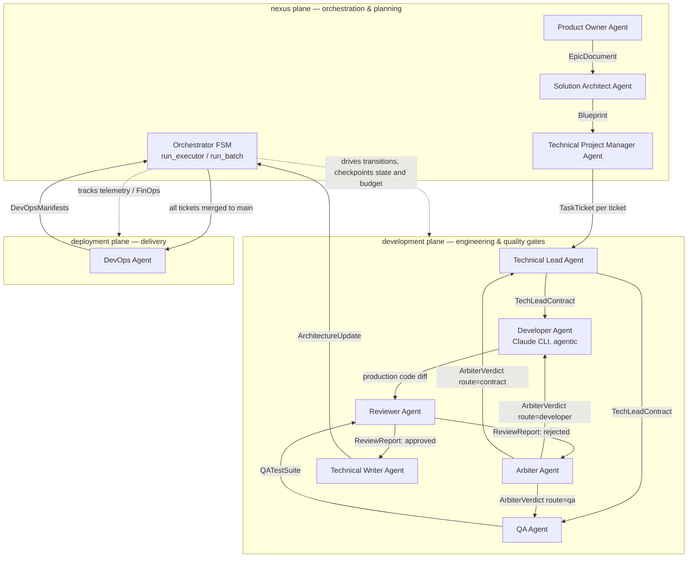

# Agentic SDLC Specification v1

**Product:** Token Burners Factory — an autonomous, agent-driven software factory.
**Cyberthone 2026 · Mission OPS_000 deliverable #1** ([mission brief](https://github.com/Cyberthon-2026-Token-Burners/token-burners-factory/blob/main/docs/hackathon/missions/00-mission-briefing.md) ·
[judge scorecard](https://github.com/Cyberthon-2026-Token-Burners/token-burners-factory/blob/main/docs/hackathon/acceptance-criteria.md)).
**Status:** implemented and runnable (this is not a paper design — every role, contract, and gate below maps
to a symbol in `src/`).

> **How to read this document.** This spec is *code-grounded*: each lifecycle stage, agent role, artifact,
> and guardrail names the exact Python symbol, Pydantic model, or file that implements it. It is the
> single source of truth for the engine an operator drives with one command:
>
> ```bash
> python3 main.py --idea "<one-line product idea>" --repo <url|path> --auto-execute --scaffold-deploy --budget 25
> ```
>
> That invocation plans the work, builds and reviews every ticket, merges each to `main`, and scaffolds
> deployment — agent-driven end to end. Entry point: [`main.py`](https://github.com/Cyberthon-2026-Token-Burners/token-burners-factory/blob/main/main.py) →
> [`src/nexus/runner.py`](https://github.com/Cyberthon-2026-Token-Burners/token-burners-factory/blob/main/src/nexus/runner.py) `main()` → `run_executor` / `run_batch`.

---

## 0. System overview

Token Burners Factory is an **asyncio finite-state-machine (FSM) orchestrator** that chains **10 specialized
agent roles** across **three physical planes** plus a shared core (ADR
[0021](https://github.com/Cyberthon-2026-Token-Burners/token-burners-factory/blob/main/docs/decisions/0021-physical-three-plane-split.md)). Agents never free-chat: every hand-off is a
**schema-validated JSON artifact** (a Pydantic model forced through the `instructor` library), and all
control flow — retries, reroutes, escalation, termination — is deterministic code, not model whim.

| Plane (`src/`) | Responsibility | Agents |
| --- | --- | --- |
| **nexus** (control) | Orchestration FSM + requirement→plan | Orchestrator (FSM), Product Owner, Solution Architect, Technical Project Manager |
| **development** (worker) | Code generation + quality gates | Technical Lead, Developer, QA, Reviewer, Arbiter, Technical Writer |
| **deployment** (infra) | CI/CD scaffolding | DevOps |
| **shared** | Models, config, observability, sandbox, forge | *(no agents — the SSOTs every plane imports)* |

Plane membership is the SSOT constant `AGENT_PLANE` in
[`config.py`](https://github.com/Cyberthon-2026-Token-Burners/token-burners-factory/blob/main/src/shared/core/config.py) — the same map the per-plane FinOps report rolls up, so the
diagram below reconciles 1:1 with the cost report.

### Agent ecosystem (physical planes)



The Orchestrator FSM (the `nexus` plane) is the only component that decides transitions; every other agent
is a pure function from its input artifact to its output artifact.

---

## 1. Lifecycle Stages (Agent-Native) — *rubric 1.1*

The eight canonical agent-native stages, each owned by a dedicated agent, with a **machine-readable I/O
contract** and an explicit **success criterion**. (We add one stage the brief does not — *Design Contract* —
because a per-ticket implementation contract is what keeps the Developer and QA deterministic; it is marked
**[+]**.)

| # | Stage | Owner agent | Input (contract) | Output (artifact) | Success criterion |
| --- | --- | --- | --- | --- | --- |
| 1 | **Requirement Ingestion** | Product Owner | raw idea string | `EpicDocument` → `artifacts/epic.md` | Epic has numeric success metrics + Given/When/Then acceptance criteria; no stack chosen |
| 2 | **Planning & Architecture** | Solution Architect | `epic.md` | `Blueprint` → `artifacts/blueprint.md` | `environment_id` ∈ `SUPPORTED_ENVIRONMENTS`; pinned versions; file topology + data contracts |
| 3 | **Task Decomposition** | Technical Project Manager | `epic.md` + `blueprint.md` | `ProjectPlan`→`TaskTicket[]` → `artifacts/TASK-NN.md` | atomic, dependency-ordered tickets; each self-contained; valid `environment_id` |
| 4 | **Design Contract** **[+]** | Technical Lead | one `TASK-NN.md` | `TechLeadContract` (+`TopologyNode[]`) | exact `files_to_modify`, a language-neutral dependency graph, function signatures; `environment_id` pinned |
| 5 | **Code Generation** | Developer (Claude CLI) | `TechLeadContract` + error trace | production files on `feat/ticket-NN` | only contracted files written; compiles (`run_build_gate`) |
| 6 | **Testing & Validation** | QA | `TechLeadContract` + code snapshot | `QATestSuite` → test files + gate runs | tests compile; **build + unit-test + lint + Semgrep SAST gates pass** |
| 7 | **Code Review** | Reviewer (+ **Arbiter** on stall) | code diff + test suite + gate logs | `ReviewReport` (Arbiter: `ArbiterVerdict`) | `code_quality_approved ∧ test_integrity_approved`; else routes a fix |
| 8 | **Deployment** | DevOps | finished app on `main` | `DevOpsManifests` → `Dockerfile` + `deploy.yml` | archetype-correct manifests pass static lint (`run_devops_gate`); merged via PR |
| ⟳ | **Monitoring & Feedback Loop** | Orchestrator + Technical Writer | every agent's telemetry + `ReviewReport` | `PipelineTelemetry`, `finops_report.json`, `sdlc_audit.log`, `ArchitectureUpdate` (living ADR) | spend within budget; self-heal loop converges or halts with an incident |

**Determinism note (brief constraint "Determinism > creativity").** Stages 1–4 and 8 emit one structured
artifact per call; stage 5 (the agentic Developer) is the only free-form actor, and it is *bounded* by the
contract scope gate + four fast-fail guardrails (§3). The feedback loop (⟳) is not a stage an agent "runs"
— it is the FSM cycling stages 4–7 until the gates pass.

---

## 2. Agent Roles & Responsibilities — *rubric 1.2 (≥6 roles; we specify all 10)*

Every role below is invoked as `run_structured_llm(role, Model, messages) -> (parsed, raw)` and returns a
forced Pydantic model — **except the Developer**, which is the agentic **Claude Code CLI** (it edits files
directly). Registration of a role touches exactly the points in
[`agent-role-registration`](https://github.com/Cyberthon-2026-Token-Burners/token-burners-factory/blob/main/.claude/rules/agent-role-registration.md). Provider/model come from
`ROLE_MODELS` (§7).

### nexus plane

**① Product Owner Agent** (`po`)
- **Consumes:** the raw idea string.
- **Produces:** `EpicDocument{ markdown }` → `artifacts/epic.md`.
- **Decides:** the *problem*, measurable success metrics, Given/When/Then acceptance criteria, scope
  boundaries. **Cannot decide:** tech stack, libraries, file layout (that is the Architect's job) — and no
  hype/marketing prose.

**② Solution Architect Agent** (`sa`)
- **Consumes:** `epic.md` (+ the original request for any explicit stack mandate).
- **Produces:** `Blueprint{ environment_id, markdown }` → `artifacts/blueprint.md`.
- **Decides:** one supported `environment_id`, pinned versions, file topology, data contracts/signatures.
  **Cannot decide:** an unsupported stack; leave any decision ambiguous.

**③ Technical Project Manager Agent** (`tpm`)
- **Consumes:** `epic.md` + `blueprint.md`.
- **Produces:** `ProjectPlan{ tasks: list[TaskTicket{ ticket_id, title, environment_id, description }] }`,
  each materialized to `artifacts/TASK-NN.md`.
- **Decides:** the atomic decomposition + dependency order; copies stack/NFR/contract into each ticket so it
  is self-contained. **Cannot decide:** assign test files (QA owns tests); reference the blueprint by name;
  alter `environment_id`.

### development plane

**④ Technical Lead Agent** (`techlead`)
- **Consumes:** one `TASK-NN.md` + repo topology (+ on amendment: the prior contract + Arbiter directive).
- **Produces:** `TechLeadContract{ files_to_modify, topology_contract: TopologyNode[], instruction,
  shared_context, architectural_constraints, core_libraries, function_signatures,
  strict_type_validation_rules, techlead_reasoning, domain_tags, environment_id }`.
- **Decides:** exact production file mapping, the language-neutral dependency graph (the import SSOT),
  signatures, constraints. **Cannot decide:** include test files; change `environment_id`; write the
  implementation itself.

**⑤ Developer Agent** (`developer` — **Claude Code CLI, agentic, not structured**)
- **Consumes:** the `TechLeadContract` + (on reroute) the **isolated** `dev_diagnostic_payload`.
- **Produces:** direct edits to production files on the `feat/ticket-NN` branch (snapshotted to
  `production_code_snapshot`).
- **Decides:** how to implement the contracted files (+ minimal justified glue). **Cannot decide / forbidden:**
  touch test files (QA's domain), act on QA-channel feedback, implement files outside `files_to_modify`
  without a top-of-file justification comment.

**⑥ QA Agent** (`qa`)
- **Consumes:** the `TechLeadContract` + production code snapshot + (on reroute) the isolated
  `qa_diagnostic_payload`.
- **Produces:** `QATestSuite{ overwrite_existing, new_imports, new_test_code, obsolete_test_names,
  files_to_delete }` per module → test files in the env's native framework.
- **Decides:** test cases (boundary/equivalence/exception), what to delete. **Cannot decide / forbidden:**
  edit production code, assert on exception *messages* (only type), import from a module the contract did
  not assign.

**⑦ Reviewer Agent** (`reviewer`)
- **Consumes:** the code diff, test snapshot, **functional test log**, **SAST log**, the contract.
- **Produces:** `ReviewReport{ code_quality_analysis, test_integrity_analysis, log_verification_analysis,
  code_quality_approved, test_integrity_approved, dev_diagnostic_payload, qa_diagnostic_payload,
  zombie_tests_to_delete }`.
- **Decides:** approval of code + tests, and **which isolated channel** a fix goes to. **Cannot decide /
  forbidden:** route a production fix to QA or a test fix to the Developer (mis-routing deadlocks the run);
  order deletion of pre-existing legacy files.

**⑧ Arbiter Agent** (`arbiter`) — *contract self-healing, ADR [0016](https://github.com/Cyberthon-2026-Token-Burners/token-burners-factory/blob/main/docs/decisions/0016-arbiter-contract-self-healing.md)*
- **Consumes:** the stuck-cycle evidence (contract, last `ReviewReport`, prior fix instructions, gate output).
- **Produces:** `ArbiterVerdict{ root_cause_class ∈ {production_bug,test_bug,contract_conflict,unrecoverable},
  route ∈ {developer,qa,contract,halt}, reasoning, contract_amendment_directive }`.
- **Decides:** the *root cause* of a loop and whether to amend the contract or halt. **Cannot decide /
  forbidden:** change `environment_id` in an amendment; emit a vague/empty verdict.

**⑨ Technical Writer Agent** (`techwriter`)
- **Consumes:** the completed task + final code snapshot + the prior `docs/architecture_state.md`.
- **Produces:** `ArchitectureUpdate{ updated_architecture_document }` → the living ADR.
- **Decides:** how to integrate the ticket's new components into the running architecture record. **Cannot
  decide / forbidden:** run before Reviewer approval; regress prior architecture state.

### deployment plane

**⑩ DevOps Agent** (`devops`) — *deploy-scaffolding, ADR [0020](https://github.com/Cyberthon-2026-Token-Burners/token-burners-factory/blob/main/docs/decisions/0020-deploy-scaffolding-and-lint-gate.md)*
- **Consumes:** the blueprint + the finished, merged repo + the env's canonical CI commands.
- **Produces:** `DevOpsManifests{ archetype ∈ {rest_api,crud_app,cli_tool}, dockerfile_content,
  workflow_content, env_scaffold_content, engineering_reasoning }` → `.github/workflows/deploy.yml` (+
  `Dockerfile` for web services).
- **Decides:** the archetype branch (web service → Dockerfile + Cloud Run; CLI → build/release matrix, **no**
  Dockerfile) and the manifests. **Cannot decide / forbidden:** embed credentials (must use Workload
  Identity Federation); invent a stricter linter than the engine's `lint_cmd`.

> **Orchestrator (FSM) — the "Orchestrator Agent" of the brief.** Not an LLM: it is `run_executor`
> (per-ticket FSM) wrapped by `run_batch` (multi-ticket loop) in
> [`runner.py`](https://github.com/Cyberthon-2026-Token-Burners/token-burners-factory/blob/main/src/nexus/runner.py). It owns every transition, checkpoint, and budget decision (§3).

---

## 3. Communication Protocol — *rubric 1.3*

### 3.1 Message schema — typed JSON, validated at the boundary
Agents communicate by **forced structured output**, not free text. `run_structured_llm`
([`llm.py`](https://github.com/Cyberthon-2026-Token-Burners/token-burners-factory/blob/main/src/shared/utils/llm.py)) calls Gemini through the `instructor` library with a
`response_model=<PydanticModel>`; the library guarantees the returned JSON **deserializes into that model or
the call raises**. Closed enums use `Literal[...]` and stack keys use field validators (e.g.
`_validate_environment_id`), so an invalid value fails at deserialization — never silently downstream. The
function returns a `(parsed, raw)` 2-tuple (parsed model + raw response carrying token usage).

Representative message (an `ArbiterVerdict` instance):
```json
{
  "root_cause_class": "test_bug",
  "route": "qa",
  "reasoning": "The test mocks json.load while production streams via ijson; the mock is inert.",
  "contract_amendment_directive": ""
}
```

### 3.2 Task contract format
Two artifacts carry the "task contract":
- **`TASK-NN.md`** — the human-readable ticket (Objective, Environment, File Paths, Tech Stack, Dependencies,
  Acceptance Criteria), emitted by the TPM. Its body becomes `ctx.pr_description` — the SSOT for the commit
  subject and PR body.
- **`TechLeadContract`** (JSON) — the *machine* contract that locks per-ticket scope: `files_to_modify` (the
  write gate for Developer + QA), `topology_contract` (the import-resolution SSOT), `function_signatures`,
  `environment_id` (selects sandbox image + gates + QA layout). The full `environment_id` chain is validated
  at three hops (see [`agent-contracts`](https://github.com/Cyberthon-2026-Token-Burners/token-burners-factory/blob/main/.claude/rules/agent-contracts.md)).

### 3.3 State management — checkpoints, not chat memory
State is **persisted Pydantic checkpoints**, not a conversational buffer or a vector store. Three documents,
each `model_dump_json` ⇄ `model_validate_json`:

| State | Model | File | Scope |
| --- | --- | --- | --- |
| Planning | `NexusState` | `reports/checkpoint.json` (nexus run) | PO→SA→TPM phase outputs |
| Per-ticket | `GlobalPipelineContext` | `reports/checkpoint.json` (exec run) | contract, snapshots, error traces, `review_report`, `arbiter_verdict`, `current_attempt`, `telemetry` |
| Batch | `BatchState` | `reports/batch_state.json` | `tickets`, `completed`, `failed`, `app_telemetry`, `nexus_merged`, `budget_marker` |

Every run also appends to an **event log**, `logs/sdlc_audit.log` (rotating, redacted) — the linear trail of
agent calls, gate results, and FSM transitions. **Resume** (`--resume <project>`) reloads these: completed
tickets are skipped, `current_attempt` is bumped *before* each save so a resumed cycle is never re-spent, and
the budget ceiling is **never persisted** (re-resolved per run, so `--resume --budget <larger>` adds money;
ADR [0022](https://github.com/Cyberthon-2026-Token-Burners/token-burners-factory/blob/main/docs/decisions/0022-application-wide-finops-budget.md)).

### 3.4 Error handling & retries
Two layers, every external call wall-clock-bounded
([`subprocess-and-external-call-safety`](https://github.com/Cyberthon-2026-Token-Burners/token-burners-factory/blob/main/.claude/rules/subprocess-and-external-call-safety.md)):
- **Transport layer** — `with_api_retry` ([`api_retry.py`](https://github.com/Cyberthon-2026-Token-Burners/token-burners-factory/blob/main/src/shared/utils/api_retry.py)) retries
  transient errors with exponential backoff; deterministic content blocks (RECITATION/SAFETY) fail fast;
  every structured call is bounded by `GEMINI_REQUEST_TIMEOUT`; the Developer CLI by
  `DEVELOPER_CLI_TIMEOUT` + an idle watchdog.
- **FSM layer — the six loops** ([`pipeline-fsm-loops`](https://github.com/Cyberthon-2026-Token-Burners/token-burners-factory/blob/main/.claude/rules/pipeline-fsm-loops.md)). One
  **outer functional-retry** loop (dynamic bound `MAX_FUNCTIONAL_RETRIES + contract_amendments *
  AMENDMENT_RETRY_BONUS`) plus **five fast-fail reroutes** that bypass the expensive Reviewer until they
  clear or hit a cap: QA signature-lint (`QA_LINT_MAX_REROUTES`), Developer guardrail
  (`GUARDRAIL_MAX_REROUTES`), QA test-compile (`QA_GATE_MAX_REROUTES`), lint gate
  (`LINT_GATE_MAX_REROUTES`), and a single compile env-retry. All caps are env-overridable constants
  ([`config-constant-convention`](https://github.com/Cyberthon-2026-Token-Burners/token-burners-factory/blob/main/.claude/rules/config-constant-convention.md)).

### 3.5 Escalation rules — when reroute becomes halt becomes human
1. **Reviewer reroute** → the failing fix goes to its **isolated channel** (`error_trace` → Developer only,
   `qa_error_trace` → QA only), and the cycle repeats (consumes one functional retry).
2. **Arbiter triage** (fires at `ARBITER_TRIGGER_ATTEMPT` on a stuck cycle) → classifies root cause and
   routes `developer` / `qa` / **`contract`** (re-derive the TechLead spec, granted bonus retries, capped by
   `MAX_CONTRACT_AMENDMENTS`) / **`halt`**.
3. **Hard halt** → `_abort_with_incident` writes `reports/incident_report.json` (redacted full context) +
   the FinOps report, then raises the **catchable** `PipelineHalt`. A single ticket bubbles it to
   `main.py` (`exit 1`); a batch **catches** it, records `failed`, and stops cleanly for `--resume`.
4. **Human checkpoints** → the PR approve/merge step (`--auto-merge`), the budget breaker (re-pass
   `--budget` to continue), and any halt's incident report are where a human re-enters the loop.

---

## 4. Artifact Standards — *rubric 1.4 (machine-readable formats for all 5 artifact types)*

All five artifact types are **Pydantic models serialized to JSON** (schema-enforced, not freeform prose) —
defined in [`models.py`](https://github.com/Cyberthon-2026-Token-Burners/token-burners-factory/blob/main/src/shared/core/models.py) and the `src/nexus/agents/*` files. This is *why*
they are machine-readable: a downstream agent deserializes the exact schema or the pipeline fails at the
boundary.

**1 · Requirements docs** — `EpicDocument` (+ the architecture `Blueprint`):
```json
{ "markdown": "# Epic: …\n## Success Metrics\n- …\n## Acceptance (Given/When/Then)\n- …" }
{ "environment_id": "python-3.12-core", "markdown": "## Tech Stack\n## File Topology\n## Data Contracts" }
```

**2 · Task definitions** — `TaskTicket` (array under `ProjectPlan.tasks`):
```json
{ "ticket_id": "TASK-01", "title": "Implement CSV reader",
  "environment_id": "python-3.12-core", "description": "Objective … Acceptance Criteria …" }
```

**3 · Code specs** — `TechLeadContract` with `TopologyNode`:
```json
{ "files_to_modify": ["src/reader.py"],
  "topology_contract": [{ "file_path": "src/reader.py", "exports": ["read_csv"],
                          "depends_on": ["src/models.py:Row"] }],
  "function_signatures": "def read_csv(path: str) -> list[Row]: raises FileNotFoundError",
  "core_libraries": ["csv"], "architectural_constraints": ["dependency injection"],
  "domain_tags": ["python","csv"], "environment_id": "python-3.12-core",
  "instruction": "…", "shared_context": "…", "strict_type_validation_rules": "…", "techlead_reasoning": "…" }
```

**4 · Test cases** — `QATestSuite` (per module):
```json
{ "overwrite_existing": true, "new_imports": "import pytest\nfrom src.reader import read_csv",
  "new_test_code": "def test_empty(): …", "obsolete_test_names": [], "files_to_delete": [] }
```

**5 · Review reports** — `ReviewReport` (+ `ArbiterVerdict` on escalation):
```json
{ "code_quality_approved": false, "test_integrity_approved": true,
  "dev_diagnostic_payload": "read_csv must raise FileNotFoundError, not return None",
  "qa_diagnostic_payload": "", "zombie_tests_to_delete": [],
  "code_quality_analysis": "…", "test_integrity_analysis": "…", "log_verification_analysis": "…" }
```

Deployment adds a sixth, `DevOpsManifests` (`archetype`, `dockerfile_content`, `workflow_content`, …); the
living architecture record is `ArchitectureUpdate`.

---

## 5. Governance & Constraints — *rubric 1.5*

### 5.1 Guardrails (security, code-safety, hallucination control)
- **Sandbox least-privilege** — every build/test/lint/SAST gate runs in a hardened Docker container via the
  single chokepoint `run_in_image` ([`docker_adapter.py`](https://github.com/Cyberthon-2026-Token-Burners/token-burners-factory/blob/main/src/shared/core/docker_adapter.py)):
  `--cap-drop ALL`, `--network none` (a network window opens only for dependency restore), non-root user,
  read-only repo mount, memory/PID/CPU caps. Adversarial generated code cannot exfiltrate, escalate, or
  poison the host. ([`qa-sandbox-hardening`](https://github.com/Cyberthon-2026-Token-Burners/token-burners-factory/blob/main/.claude/rules/qa-sandbox-hardening.md).)
- **SAST** — a generic **Semgrep** gate (`run_security_scan`, `SAST_IMAGE`/`SAST_CMD` in
  [`environments.py`](https://github.com/Cyberthon-2026-Token-Burners/token-burners-factory/blob/main/src/shared/core/environments.py)): one offline image with vendored rules scans
  every language; non-zero exit fails the gate. *(Note: the engine's **own** CI uses `bandit -r src/`; the
  generated-app SAST gate is Semgrep — distinct tools, distinct targets.)*
- **Hallucination control** — the `TechLeadContract` is a hard **scope gate**: the Developer may write only
  `files_to_modify`, any extra file needs a justification comment, and the Reviewer classifies uncontracted
  files as *justified addition* vs *hallucinated garbage* vs *legacy victim*. The `topology_contract` is the
  import-resolution SSOT, so symbols resolve deterministically.
- **CI-parity lint gate** — `run_lint_gate` runs the env's exact `lint_cmd` (FSM step 3.6), the same command
  the generated CI runs, so *engine-green ⇒ CI-green*
  ([`deploy-scaffolding-and-ci-parity`](https://github.com/Cyberthon-2026-Token-Burners/token-burners-factory/blob/main/.claude/rules/deploy-scaffolding-and-ci-parity.md)).
- **Boundary safety** — every subprocess argv is run through `sanitize_for_argv`; every external call is
  time-bounded (above). Secrets are stripped from logs by a redaction filter; deploy credentials are
  Workload Identity Federation, never embedded.

### 5.2 Approval checkpoints
- **`all_gates_passed`** = `qa_success ∧ sec_success ∧ lint_success ∧ code_quality_approved ∧
  test_integrity_approved` — the single gate a ticket must clear to finalize.
- **Forge PR checkpoint** (E2, `--auto-merge`) — on success the engine opens a PR `feat/ticket-NN` → base,
  best-effort approves it (a separate reviewer token), and squash-merges via
  [`forge.py`](https://github.com/Cyberthon-2026-Token-Burners/token-burners-factory/blob/main/src/shared/utils/forge.py). A failed ticket never reaches the PR step.
- **Financial circuit breaker** — `enforce_financial_circuit_breaker(ctx, budget_usd)` halts before any
  spend that would exceed the (threaded, remaining) money ceiling.

### 5.3 Observability (logs, traces, decisions)
- **`sdlc_audit.log`** — per-run, append-only, redacted event trail (diagnosable by the `/tbf-analyze-run` skill).
- **`PipelineTelemetry`** — per-agent **tokens / cost / time** with `provider` + `plane`, rolled up by
  `by_agent()`, `by_provider()`, `by_plane()`; cache tokens tracked but excluded from the budgeted total
  ([`token-budget-excludes-cache`](https://github.com/Cyberthon-2026-Token-Burners/token-burners-factory/blob/main/.claude/rules/token-budget-excludes-cache.md)).
- **FinOps reports** — `finops_report.json` (per ticket) and `app_finops_report.json` (whole build:
  per-role + per-plane + time), always written in a `finally` so a halt still records spend (ADR 0022).
- **`incident_report.json`** — full redacted context on any FSM halt.

---

## 6. Success criteria & constraints — mapping to the engine

How the engine satisfies the brief's "system is successful if…" bar:

| Brief success criterion | Engine mechanism |
| --- | --- |
| ≥80% runs without human intervention | one CLI invocation drives plan→build→review→merge→deploy; the FSM makes every transition |
| Artifacts consistent + machine-readable | every hand-off is a schema-validated Pydantic/JSON model (§4) |
| Code passes QA-generated tests | `all_gates_passed` requires the QA suite to pass before merge (§5.2) |
| Recover from ≥2 simulated failures | the six FSM loops + Arbiter contract self-healing + financial breaker (§3.4–3.5) — e.g. a bad test reroutes to QA, a flawed contract triggers an amendment |
| Re-run with modified requirements | re-plan from a new `--idea`, or `--resume <project>` to continue/extend; checkpoints make it idempotent |

**Constraints honored:** *pure agents ≠ no structure* — strict contracts per stage; *orchestration > model
intelligence* — a deterministic FSM, not a mega-prompt; *determinism > creativity* — structured outputs +
validators everywhere; the only free-form actor (Developer) is scope-gated.

---

## 7. Model & Reasoning-Effort Routing (cost governance) — *informs rubric 7.2 / 7.3*

Cost efficiency is engineered as **per-role routing enforced in code**, along two tuning axes that together
form a `{model} × {effort}` matrix — so a role's cost can be dialed to its difficulty.

### Axis 1 — model tier *(implemented today)*
Each role binds to a model via a per-role constant → `ROLE_MODELS` → `run_structured_llm`
([`config.py`](https://github.com/Cyberthon-2026-Token-Burners/token-burners-factory/blob/main/src/shared/core/config.py)). Two provider catalogs are available:

- **`AVAILABLE_GEMINI_MODELS`** (structured roles), most→least capable, priced in `MODEL_PRICING_MATRIX`
  (cache-aware, long-context-tiered): `gemini-3.1-pro-preview` · `gemini-2.5-pro` · `gemini-3.5-flash` ·
  `gemini-2.5-flash` · `gemini-3.1-flash-lite` · `gemini-2.5-flash-lite`.
- **`AVAILABLE_CLAUDE_MODELS`** (the agentic Developer CLI): `opus` · `sonnet` · `haiku`.

Gemini spend is **estimated** from token counts; Claude spend is **authoritative** (CLI-reported). Cost is
the sole budget gate (money-only); cache tokens are excluded.

### Axis 2 — reasoning effort / thinking depth *(roadmapped — see [BACKLOG #28](https://github.com/Cyberthon-2026-Token-Burners/token-burners-factory/blob/main/docs/BACKLOG.md))*
The same role can be tuned by *how hard the model thinks*, which multiplies the effective matrix without
adding models:
- **Claude** exposes `AVAILABLE_EFFORT_LEVELS` (`low`→`max`); today the Developer uses a single global
  `DEVELOPER_EFFORT`.
- **Gemini** exposes `thinking_level` (3.x) / `thinking_budget` (2.5) via `thinking_config`.

> **Honest status (judges cross-check the code):** the model catalogs and the `ROLE_MODELS` routing
> *mechanism* are real and code-enforced. **Per-role effort and Gemini `thinking_config` are not yet wired**
> — they are tracked as [BACKLOG #28](https://github.com/Cyberthon-2026-Token-Burners/token-burners-factory/blob/main/docs/BACKLOG.md). And the **current default assignment is flat**: all
> nine Gemini roles sit on `gemini-3.5-flash` (only the Developer differs, on `sonnet`). The mechanism to
> differentiate exists; the assignment has not yet been tuned.

### Recommended tiering policy
| Role class | Roles | Recommended tier |
| --- | --- | --- |
| Complex reasoning | Solution Architect, Technical Lead, Reviewer, Arbiter | `gemini-2.5-pro` / `gemini-3.1-pro-preview` (high effort) |
| Standard generation | Developer | `claude-sonnet` (medium effort) |
| Cheap / mechanical | Technical Writer, log-summary, formatting, DevOps lint | `gemini-2.5-flash-lite` (minimal effort) |

Tuning these `ROLE_MODELS` assignments + landing [#28](https://github.com/Cyberthon-2026-Token-Burners/token-burners-factory/blob/main/docs/BACKLOG.md) is the path to full marks on dimension 7.2/7.3.

---

## Appendix · Source map

| Concern | Symbol / file |
| --- | --- |
| Orchestrator FSM | `run_executor`, `run_batch`, `enforce_financial_circuit_breaker`, `_abort_with_incident`, `PipelineHalt` — [`src/nexus/runner.py`](https://github.com/Cyberthon-2026-Token-Burners/token-burners-factory/blob/main/src/nexus/runner.py) |
| Planning agents | [`src/nexus/agents/{po,sa,tpm}.py`](https://github.com/Cyberthon-2026-Token-Burners/token-burners-factory/tree/main/src/nexus/agents) |
| Worker agents | [`src/development/agents/{techlead,developer,qa,reviewer,arbiter,techwriter}.py`](https://github.com/Cyberthon-2026-Token-Burners/token-burners-factory/tree/main/src/development/agents) |
| DevOps agent | [`src/deployment/agents/devops.py`](https://github.com/Cyberthon-2026-Token-Burners/token-burners-factory/blob/main/src/deployment/agents/devops.py) · scaffold [`src/deployment/provision/scaffold.py`](https://github.com/Cyberthon-2026-Token-Burners/token-burners-factory/blob/main/src/deployment/provision/scaffold.py) |
| Artifact models | [`src/shared/core/models.py`](https://github.com/Cyberthon-2026-Token-Burners/token-burners-factory/blob/main/src/shared/core/models.py) |
| Structured-LLM seam | `run_structured_llm` — [`src/shared/utils/llm.py`](https://github.com/Cyberthon-2026-Token-Burners/token-burners-factory/blob/main/src/shared/utils/llm.py) |
| Gates | `run_build_gate`, `run_qa_unit_tests`, `run_security_scan`, `run_lint_gate` — [`src/development/gates.py`](https://github.com/Cyberthon-2026-Token-Burners/token-burners-factory/blob/main/src/development/gates.py) |
| Routing / cost | `ROLE_MODELS`, `AGENT_PLANE`, `MODEL_PRICING_MATRIX` — [`src/shared/core/config.py`](https://github.com/Cyberthon-2026-Token-Burners/token-burners-factory/blob/main/src/shared/core/config.py) |
| Sandbox / forge | [`docker_adapter.py`](https://github.com/Cyberthon-2026-Token-Burners/token-burners-factory/blob/main/src/shared/core/docker_adapter.py) · [`forge.py`](https://github.com/Cyberthon-2026-Token-Burners/token-burners-factory/blob/main/src/shared/utils/forge.py) |
| Architecture (C4 + sequence) | [`docs/ARCHITECTURE.md`](https://github.com/Cyberthon-2026-Token-Burners/token-burners-factory/blob/main/docs/ARCHITECTURE.md) · decisions [`docs/decisions/`](https://github.com/Cyberthon-2026-Token-Burners/token-burners-factory/tree/main/docs/decisions) |

*Spec version 1 · reflects the engine as of ADR 0022 (E5). Cross-checked against `src/` on authoring.*
